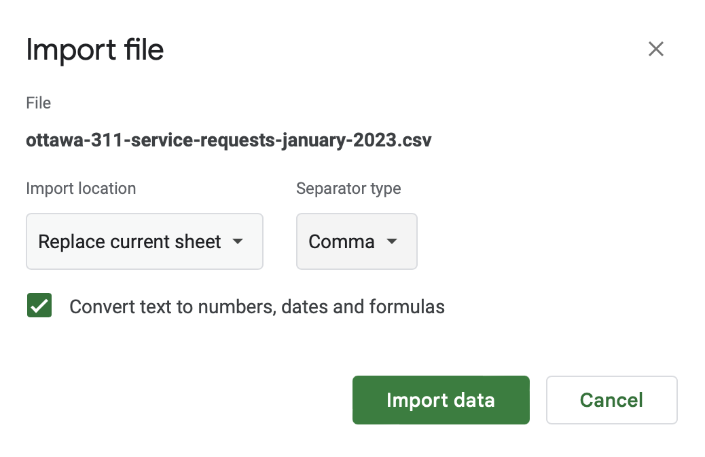
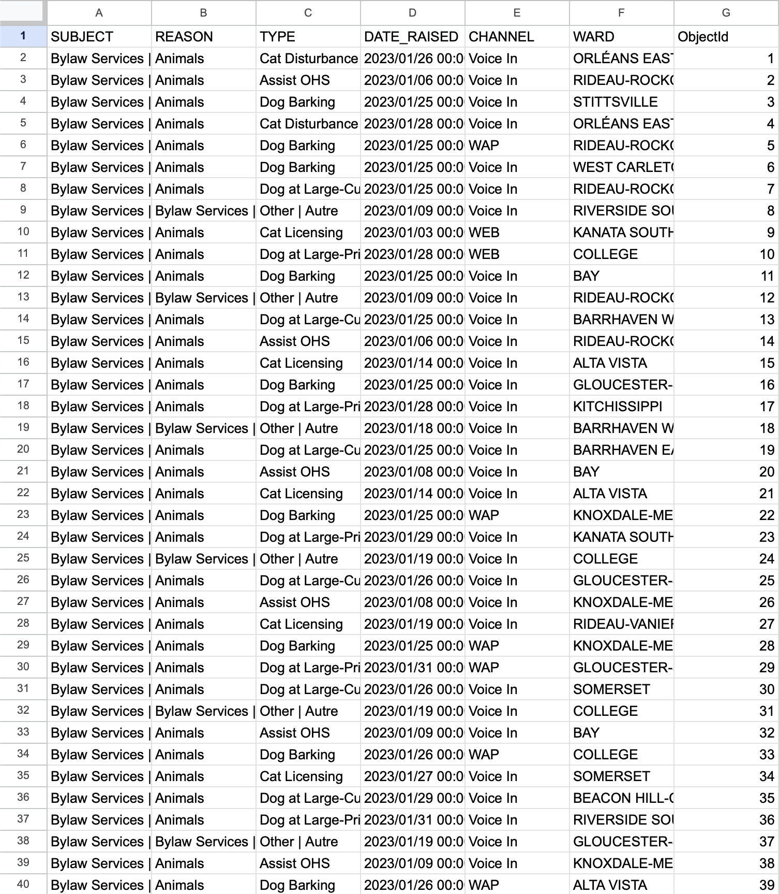
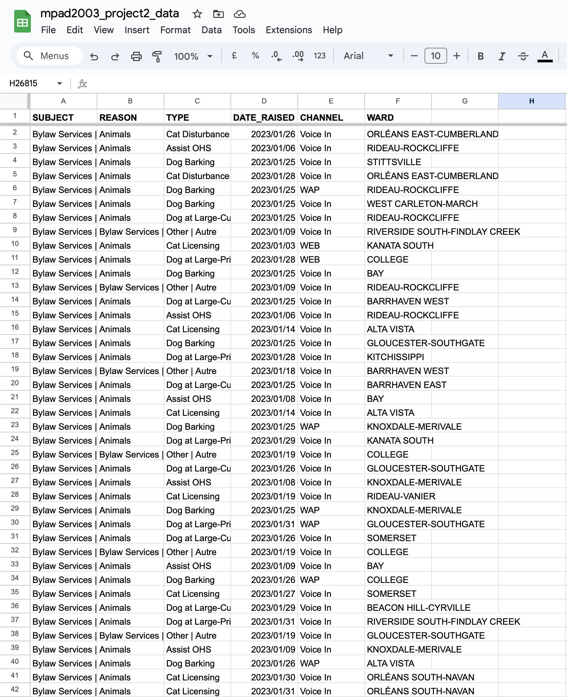
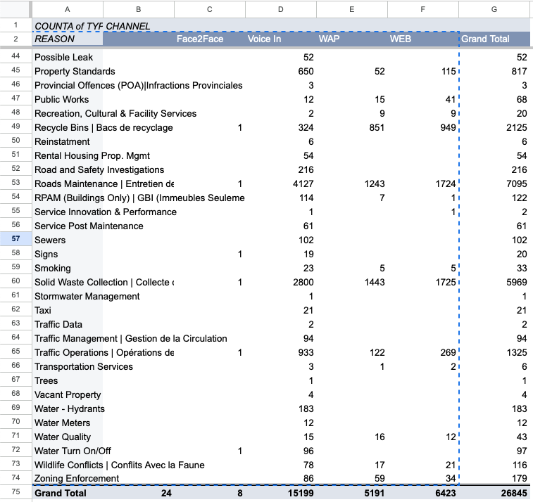
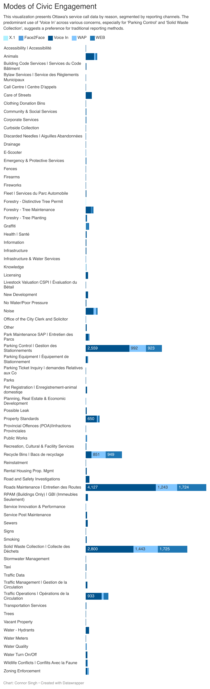

**Friday November 24 2024**<br>
**MPAD 2003 Introductory Data Storytelling**<br>
**Connor Singh**<br>
**Presented to Jean-Sébastien Marier**<br>

# Project 2: Basic Data Analysis & Visualization


## 1. Introduction

In this report, I delve into an in-depth analysis of service requests in Ottawa, aiming to uncover the primary concerns of its residents and their preferred communication methods with local authorities. The study focuses on categorizing these requests by their underlying reasons and examining the various reporting channels utilized by the community. This exploration is designed to provide a comprehensive understanding of the most pressing civic issues and the dynamics of how these concerns are communicated to city officials.
<br>

## 2. Getting Data

 Importing the data into Google Sheets was quite simple. First, I followed the link "CSV file from my GitHub repository" provided in the assignment description and downloaded it as a .csv file. Next, I opened up a new Google Sheets file, went to file - import - upload, and uploaded the CSV file with the import location set to "replace spreadsheet" and the separator as "comma".
 <br> 
In examining the dataset with 26,845 entries across just 7 columns, I observed several compelling patterns and anomalies. The data, while extensive, showed consistent themes in the earlier columns, with 'Bylaw Services' as the predominant subject up to the 3200th entry, after which it transitions to 'Corps Complaints.' Interestingly, the 'Reason' column, initially dominated by animal-related issues, diversifies post the 800th entry to include 'Care of Streets', 'Licensing', and 'Parks', revealing a broadening scope of service categories. Around the 1200th mark, noise-related complaints such as music, yelling, and construction started appearing, indicating varied and evolving community concerns. Notably, the dataset encompasses a wide array of 12 unique subjects, with a prominent focus on 'Roads and Transportation', and 72 unique reasons for service calls, suggesting a comprehensive coverage of community issues. The 'Type' column further diversifies this picture, reflecting the intricate nature of the services addressed.
<br>
This dataset thus not only provides a detailed snapshot of the types of issues encountered by the service departments but also offers insights into temporal trends, geographical patterns, and communication preferences. The variability and consistency observed across different columns illuminate the complex tapestry of community needs, service responses, and the multifaceted nature of municipal operations. These observations could be pivotal in guiding targeted service improvements, policy planning, and resource allocation, ensuring a more responsive and efficient community service framework.
<br>
"How does the frequency of service calls vary across different wards in Ottawa, and what specific types of issues are most prevalent in the wards with the highest number of service calls?" This question aims to investigate both the distribution of service calls across various geographic areas in Ottawa and to identify the nature of the issues that are most common in the wards with the highest frequencies of calls. This analysis will provide insights into whether certain wards face more challenges than others and what those challenges are, which can be crucial for targeted policy-making and resource allocation.


<br>
*Figure 1: Importing the dataset into Google Sheets.*
<br>


<br>
*Figure 2: The CSV data in Google Sheets.*

[Link to dataset](https://docs.google.com/spreadsheets/d/1-5zMoZkcVM2AVonTv4MaRpOtUMiWvHk3xrzonO0j34U/edit?usp=sharing)


<!--
**Here are examples of functions and lines of code put in grey boxes:**

1. If you name a function, put it between "angled" quotation marks like this: `IMPORTHTML`.
1. If you want to include the entire line of code, do the same thing, albeit with your entire code: `=IMPORTHTML("https://en.wikipedia.org/wiki/China"; "table", 5)`.
1. Alternatively, you can put your code in an independent box using the template below:

``` r
=IMPORTHTML("https://en.wikipedia.org/wiki/China"; "table", 5)
```
This also shows how to create an ordered list. Simply put `1.` before each item.
-->

## 3. Understanding Data

### 3.1. Cleaning Data

VIMO

I started by examining valid values and observed that in the 'Ward' column, some entries are missing, such as entries 181, 319, and 517. However, the entries present in the 'Ward' column are all valid and correspond to actual wards in Ottawa. In the 'Subject' column, each entry is valid and appropriate, ranging from 'Bylaw Services' to 'Water and the Environment' and 'Forestry,' all aligning with municipal services. The 'Date Raised' column contains valid dates within the expected calendar year range. Although the 'Ward' column is missing some entries, there are no invalid data entries across the dataset; all data fits the proper formatting. Dates follow the correct format, 'Ward' names are consistently in all caps, and the 'ObjectId' increments sequentially. Additionally, my analysis revealed that the 'Channel' column has 24 missing entries, indicating a minor gap in data recording. However, the variability in the 'Channel', 'Ward', and 'Date Raised' columns reflect the dynamic nature of community interactions and service responses, without any discernible pattern at first glance. Overall, despite the identified gaps in the 'Ward' and 'Channel' columns, the dataset demonstrates commendable integrity with consistent and valid data entries, ensuring a reliable foundation for any subsequent analysis and interpretation.

To clean my data, I first froze the first row, that way the headers are always visible even if you are not at the top of the page. Next, I got rid of 'ObjectID' as it seemed redundant and was not needed. I also split the 'DATE_RAISED' column. I split it into the date in one column, and the time in another. From there, I copied them as values, deleted the original, and deleted the time as well, so we're left with the date in the column.

<br>
*Figure 3: Cleaned up data using Google Sheets freeze, SPLIT and CONCATENATE functions*


### 3.2. Exploratory Data Analysis

In crafting the pivot table, the variables selected were 'REASON' for rows and 'CHANNEL' for columns, with a count of 'SUBJECT' as values. This structure was chosen to illuminate the volume and modes of service requests, providing insight into the community's concerns and reporting behaviors. Cairo (2016) notes that “visualizations... transform the symbolic into the geometric”, a principle applied here to translate abstract data into a concrete form that reveals patterns of civic engagement. Notably, 'Voice In' is the predominant channel across most reasons, with 'Solid Waste Collection' and 'Parking Control' drawing the highest counts, suggesting these are critical issues for residents and they prefer to address them through direct communication. The key takeaway is the community's reliance on traditional voice reporting, which could reflect the need for personal interaction when dealing with pressing civic issues—a reflection of Cairo’s assertion that "we must always strive to find ways to make the invisible visible".
<br>
The data tells a story of community engagement and the importance of accessible, responsive service channels. For the main visualization, the focus will be on showcasing the most frequently reported reasons, particularly 'Solid Waste Collection' and 'Parking Control', and highlighting 'Voice In' as the primary communication channel. As Cairo (2016) would put it, the objective is to create a visualization where “the functional trumps the ornamental” (p. 62), ensuring that these elements effectively convey the urgency and preferred reporting methods for these community issues.

<br>
*Figure 4: Excel sheet turned to pivot table - more organized data*

<br>

<br>
*Figure 5: Explore chart with pivot table data*


## 4. Delivering Data

I went through many different iterations of the tables to find one that would work well. Many were way too big and would be too large to show in DataWrapper. Once I finalized my pivot table, I copied and pasted it into DataWrapper. All my data was valid so I did not need to edit anything. The default chart they gave me was a line graph although this showed big jumps in differences, it did not show all the information/data such as the reasons. Cairo (2016) emphasizes that "the first step to understanding what numbers mean is to visualize them", highlighting the importance of choosing the right chart type. I settled on a stacked bar chart, having reasons go down in columns, and how they got reported as the stacked bars. This chart type not only aligns with Cairo's (2016) principle that "good visualization should reveal the true nature of data" but also lets you compare how many calls were made for each reason, as well as being able to see how they got reported as the ‘CHANNEL’ bars were side-by-side.

<br>
*Figure 6: The map created with Datawrapper*
[Online version here](https://datawrapper.dwcdn.net/aGcci/1/)

## 5. Conclusion

In this analysis of Ottawa's service requests, the data's narrative vividly portrays the city's civic landscape, illuminating both prevalent concerns and communication preferences of its residents. The dataset, with 26,845 entries across seven columns, uncovers significant patterns in service requests, most notably the high frequency of 'Solid Waste Collection' and 'Parking Control' reports. This finding points to these areas as critical issues for residents, who predominantly rely on traditional 'Voice In' channels for reporting, reflecting a preference for direct, personal communication in addressing urgent municipal matters. The absence of a discernible pattern in variables such as 'Channel', 'Ward', and 'Date Raised' underscores the dynamic nature of community needs and interactions. The reliance on voice reporting highlights the community's trust in direct, accessible communication, emphasizing the necessity for efficient and responsive municipal service channels. This study provides invaluable insights for city officials and policymakers, indicating areas for targeted service delivery improvements and communication strategies. It underscores the importance of a municipal framework that is not only responsive but also adaptable to the evolving needs of its residents, thus enhancing the overall efficacy of community services in Ottawa.


## 6. References


The Truthful Art: Data, Charts, and Maps for Communication. New Riders, 2016.
https://learning.oreilly.com/library/view/the-truthful-art/9780133440492/?ar= 


OpenAI. (2023). ChatGPT (Feb 13 version) [Large language model]. 
https://chat.openai.com 


